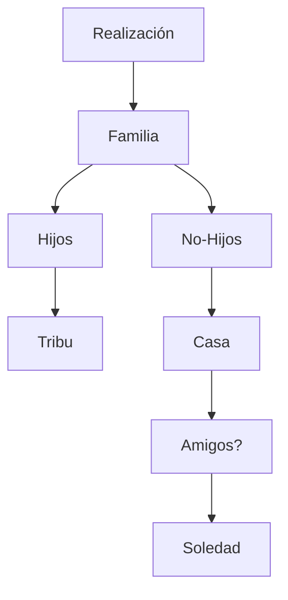

Vamos a ir avanzando algunas cosas sobre el tema literario. 

Empezamos trazando un campo de palabras:

Ideas tomadas de antiguas conversaciones con Bieito, (cuando todavía se podía salir a pasear por la noche) y algunas con Santi, seguimos con las listas: 

- Bieito tenía muy claro que no quería tener hijos; su argumento principal era la decepción que siente (quizás la que sentía entonces) con la vida en general; se centraba en el futuro de la humanidad (¿A qué mundo voy a traer a mis hijos?) y la falta de respeto de los seres humanos al resto de los seres que habitan el planeta. En resumen, su opinión es que los humanos nos comportamos como si la tierra fuera nuestra, como si no hubiera nadie más aquí. 
- En el fondo, Bieito no quiere tener hijos porque es consciente de que esta decisión no es una decisión neutra, sino que afecta al resto de la comunidad seres vivientes, porque implica ocupar un espacio y unos recursos que ¿nos pertenecen? No lo creo, en el fondo... ¿Tener hijos es una decisión individual? En principio nos parece una decisión individual de cada progenitor, pero realmente no lo es; hay algunas pistas en este argumento de Bieito:
  - las enternas intromisiones de las madres/tías/amigos en las parjeas de los recién casados, 
  - o la evidente vigilancia a la que están sometidas las familias en el cuidado de los hijos, 
  - por otro lado decimos: "Mis hijos/as" y nos parece que no hay nada más personal que la decisión de tener o no tener hijos, pero en el fondo sabemos que los hijos no son "nuestros", al menos no en el mismo sentido que es nuestro un bolígrafo o un ordenador. 

Quizás no tener hijos sea una decisión personal y tenerlos una decisión no estrictamente personal... (como la de unirse a un club en la que tienes que ser admitido)... Pero tampoco parece que tomar la decisión de no tener hijos sea estrictamente privada; es obvio que hay una presión social para tener hijos; no voy a detenerme mucho aquí, creo que está claro que esta presión existe; sin duda las mujeres sufren más esta presión, y de hecho se ha escrito mucho sobre el tema, yo mismo he tenido conversaciones con Jennie sobre esto. Pero no es verdad que los hombres no se vean sometidos a cierta presión, yo mismo me siento presionado ¿En qué sentido? 
- **La presión directa;** "A ver cuádo tienes hijos/ a ver cuándo voy a tener nietos..." etc. (quizás este tipo de presión es la que más sufren las mujeres). 
- **La presión indirecta,** cuando ves que todos tus amigos y amigas son padres/madres y te ves obligado a buscar nuevos amigos (cuando es obvio que cambiar de amigos no es como ir al supermercado a comprarase unas zapatillas nuevas). El cambio de relación con los amigos, no es simplemente que ya no estén en los encuentros sociales, es que están literalmente en otro mundo:
  - Temas y preocupaciones diferentes
  - olvídate de quejarte ante un amigo-padre de que has dormido poco o de que estás cansado, o de que estás preocupado por algo; ellos lo están más, siempre. 
  - Ell@s simplemente son felices y tú no. 
- **presión evolutiva/existencial,** hay algunas personas, tanto hombres como mujeres, que sienten que tener hijos es algo que nos realiza, bien porque es nuestro fundamento biológico como seres vivos (la reproducción); bien porque ocuparse de uno mismo nos convierte en una especie de Barón de Munchausen (que se intentaba mantener a sí mismo en el aire tirándose de su propia coleta), es decir decidir no tener hijos nos convierte probablemente en personas egocéntricas o individualistas que sólo viven para sí mismas. 

Que alguien decida no tener hijos no supone que tiene una psicopatía, que es egocéntrico o que es una persona individualista; tenemos ejemplos contrarios; Bieito, por ejemplo, lo hace desde una preocupación real por la situación planetaria; pero es verdad que hay alguna clase de riesgo en que alguien decida no tener familia/tribu, y que se aisle del resto de la sociedad; está claro que aquí podemos ver algo más o menos mórbido; y en este sentido, los demás, tienen cierto derecho a desconfiar de alguien que ha decidido quedarse sólo. Una persona soltera es vista con desconfianza en algunos contextos:
- He detectado que las parejas de algunas de mis amigas preferirían que sus amigos no estuvieran solteros, es evidente que hay aquí varias cuestiones, 
  - una podría ser simplemente una cuestión práctica (es mejor ir a cenar dos parejas que una pareja y alguien suelto); 
  - por otro lado está la idea (probablemente equivocada) acerca de una supuesta fragilidad del matrimonio; pensamos que la monotonía y el estrés derivado de la vida familiar (sobre todo en contextos de hijos recién nacidos, crisis económicas, dificultades varias) hacen que el matrimonio sea algo vulnerable, y que una tercera persona puede terminar de quebrarlo; creo que se subestima la fortaleza del matrimonio. Claro, supongo que hay situaciones y situaciones, pero tengo bastante claro que la mayoría de matrimonios serían capaces de superar incluso una situación de infidelidad puntual; me parece evidente que debe haber más infidelidades en el seno del marimonio que divorcios(es decir, imagino que estás cosas se superan, o se esconden muy bien).
- Es más difícil que a una persona soltera le dejen adoptar, y peor si es hombre. 
- En general se ve al/la solter@ como alguien a quien le falta algo. Todo el mundo intenta solucionar "ese problema". "Necesitas una mujer" (o "necesitas un hombre"). 

Para terminar por hoy voy a dejar aquí, aunque sea un simple retazo, de alguna conversación con Santi (Santi es etólogo) acerca del cuidado parental en los animales. No recuerdo bien todo el hilo de la conversación pero preguntándole sobre las estructuras familiares de chimpancés, gorilas y bonobos; llegamos a la conclusión de que podría haber cierta relación entre las capacidades de ToM y la cantidad de miembros de un grupo con las estructuras sociales; muchos individuos no especialmente buenos en ToM tienden a construir sociedades verticales (jerarquía) en estas sociedades las familias se construyen basándose en sistémas poligámicos (creo que también podrían ser poliándricos) mientras que sociedades más pequeñas, con estructuras más horizontales y mejores capacidades mentalistas, tienden a la poliginandria; creo que esto tiene que ver con la posibilidad de conocimiento-confianza entre los miembros, y con la capacidad mental del individuo de gestionar un grupo más elevado de contactos sociales (todo esto son hipótesis de bar). 

Las aves, tienen poca capacidad de gestionar, a largo plazo muchas relaciones sociales, su mecanismo de agregación social es lo que Santi llamó "impronta", es casi un mecanismo puramente biológico, con estas características las aves tenderían a ser monogámicas durante toda su vida. En resumen, Santi dice que somos primates que nos comportamos como pingüínos. 

De aquí me interesa lo siguiente; las sociedades se basan en la confianza y en la capacidad de expulsar al miembro tramposo, por otro lado, como las aves tienen una ToM más limitada que los primates, su mecanismo de conocimiento-confianza se basa en relaciones duraderas y numéricamente reducidas. Debería investigar sobre todo esto.

Otro trema del que hablé con Santi es la idea del cuidado parental, es decir, aquellos animales que comparten la crianza con varios individuos, no sólo los progenitores, esto sucede con los bonobos o los pinguinos, no recuerdo muy bien esta conversación creo que debería investigar sobre el tema.

Entiendo que debe haber algún problema con nuestra estructura social. Nosotros tenemos las mejores capacidades ToM del reino animal, somos perfectamente capaces de crear entornos de confianza, incluso con bastante gente, y sin embargo vivimos cada vez más aislados unos de otros, con estructuras sociales cada vez más pequeñas, sin compartir el cuidado parental (que incluso se ve como pedir un favor... Dejarle a los niños a alguien etc). Siento que cada vez más las relaciones sociales son más puntuales y superficiales, nadie trabaja en confiar en los demás, y esto solo puede derivar en miedo, e individualismo, es decir en sociedades más verticales.

Menudo rollo...

