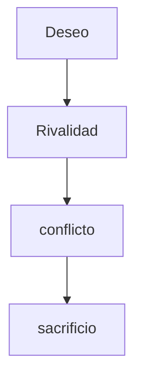

Estuve viendo una charla tipo podcast con un doctorando de filosofía que hablaba sobre el origen del mal desde la doctrina de un filósofo que no conocía, René Girard, según parece él crea una especie de estructura que extrae de algunos textos literarios como Romeo y Julieta o bíblicos, como el mito de Caín y Abel. 

La estructura sería algo así: 

Girard habla de deseo mimético porque lo que se anhela es apropiarse del deseo ajeno y no del objeto en sí que posee el otro, el objeto sirve como representación. Es más bien una cuestión de status. Por eso debería ser presentado en una situación de escasez.

El otro inspira el deseo pero se advierte como un “obstáculo” a derribar para conseguir la plenitud. Surge el conflicto, este conflicto se va a extender en el contexto social. El conflicto se reproduce en todas las relaciones cercanas hasta que inunda la colectividad, se produce una polarización. 

La violencia se incrementa de forma irracional y es preciso resolverla, pero no con el monopolio legítimo de la violencia por el Estado, que propone Hobbes, sino a través de la propia violencia colectiva actuando a través de lo que Girad identifica como “mecanismo sacrificial”. Según él se encauzará contra un solo enemigo, una especie de chivo expiatorio al que se creerá preciso sacrificar para restablecer la “concordia” entre el resto. Se trata de una violencia del tipo sacrificial. Precisamente este elemento *Sacer* es lo que frenará la violencia como culmen. Realmente para que el sacrificio cumpla su función será preciso que sea visto como línea roja traspasada, por lo que la víctima ha de ser inocente o vulnerable.

Por supuesto me ha sorprendido lo tremendamente equivocado que puede estar alguien tan inteligente. Supongo que a veces el pensamiento complejo tiene este tipo de riesgos. Me interesa el esquema de Girard desde un punto de vista literario, creo quer tiene mucho interés narrativo, y es más original el esquema del héroe a fin de cuentas. Acepto que existe ese deseo de ocupar el status del otro y que este deseo se simboliza en ocasiones por el deseo a un objeto representativo, y que si este objeto es escaso ocasionará violencia y en determinados casos polarización social y una escalada de violencia, y que en contextos violentos se producen perdidas injustas que en ocasiones sirven como alertas o momentos límite, como de haber cruzado un umbral que no se debería haber cruzado, pero la función de esa llamada muerte sacrificial no es esa, es una muerte innecesaria que no debió producirse en ningún caso, es una consecuencia de la violencia. Aceptar el sacrificio injusto de una víctima como algo bueno para la sociedad me parece un argumento abyecto, y me cuesta entender cómo alguien puede defenderlo seriamente. En el caso extremo la víctima aceptará la posibilidad de su muerte como parte de su lucha pero no porque morir en sacrificio sea algo bueno per se, sino porque no hay otra manera de seguir luchando que aceptar ese riesgo, que en ocasiones resultará ser inevitable. La presentación del héroe en sacrificio para salvar la humanidad me parece ya un tópico manido.

Creo que podemos profundizar en porqué y bajo qué condiciones un sacrificio tiene ese efecto sagrado, (hablaré de sacrificio aunque preferiría utilizar algún término como cima del conflicto o algo así) algunas propuestas preliminares:

1. Eso no siempre sucede, habrá aparentes sacrificios que no sirvan para nada.
2. Habrá situaciones de violencia que terminen no por culminación sino por agotamiento
3. En todo cambio de equilibrio social se produce una generación de nuevas normas, esta generación se realiza en un esquema propuesta contrapropuesta, siguiendo procesos comunicativos e intentando generar un nuevo equilibrio en las relaciones comunicativas. Es como los niños cuando juegan y van cambiando las normas del juego a medida que van jugando.
4. Se produce un esquema de escalada simétrica y esta escalada se rompe con ese evento culminante, mediante lo que se llama en el mundo de las subastas *el salto de la rana,* alguien hace una propuesta que supera las normas previamente establecidas como queriendo quebrar el juego, como diciendo*esto no es un juego,* entonces el juego termina porque se rompe la escalada.

